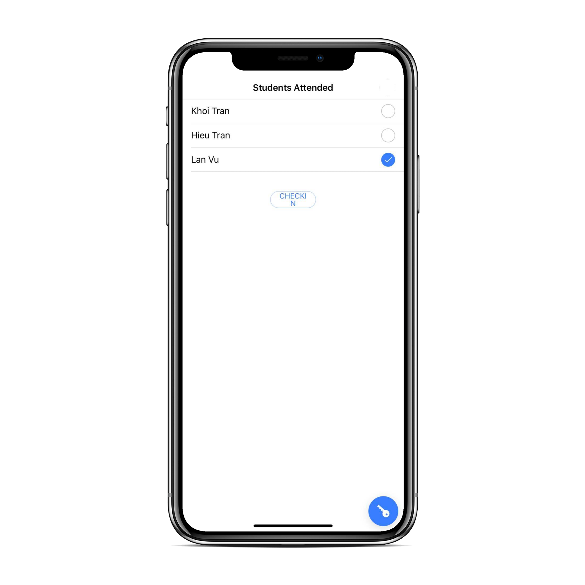
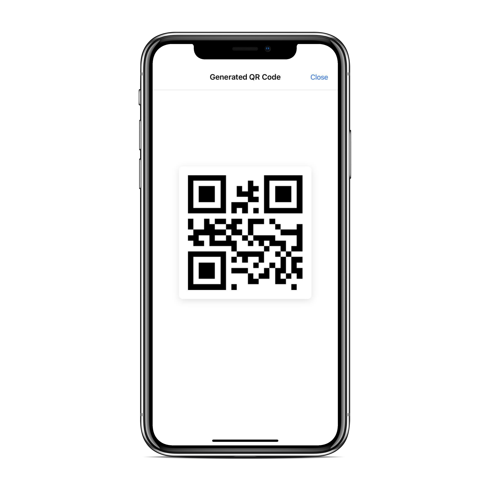
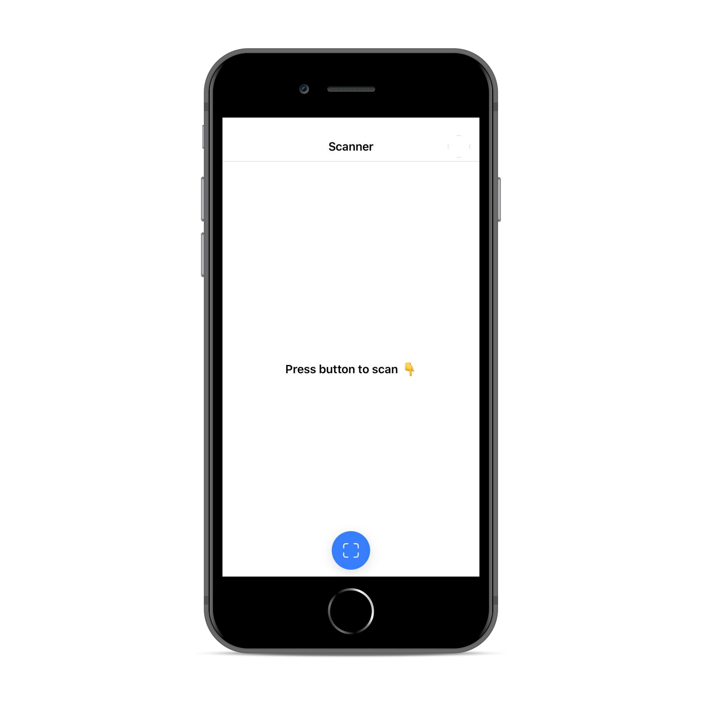

## Inspiration

Being Teaching Assistants and students ourselves, we understand that students' attendance is very important for the success of students. A study showed that the higher a student's attendant rate the more successful he/she is in class.

However, the way professors check students' attendance is inefficient. Usually, professors pass around an attendant sheet or call the students' names. Both ways cost a lot of time and effort to professors and students.

To address this problem, we propose a new check-in system for professors and students.

This system would reduce a ton of time and effort in 6 million classes across 40000 universities worldwide.

## What it does

AreYouHere is a cross-platform mobile application for both students and professors. The professors can generate a QR code for his session class and students can scan the QR code to check-in automatically. Professors can manage his students' attendance in the session and in the entire semester.

## App Preview

### Professor View

  
  

### Student View

  
  

## How we built it

AreYouHere contains 2 major components:

1. The Back-End - Web server. The back end is built on Java as a web server. We built a NoSQL database for scalable and fast querying. The back end uses the Spring Framework and Restful API to manage the connection between server and client. The server is running on AWS.

2. The Front-End (this repo) - a cross-platform mobile application that can run on both iOS and Android smartphones. We used Ionic and Angular framework to ensure a nice and smooth user interface that can run on either platform. We also utilized Cordova for camera access and native development.

## Challenges we ran into

We are all new to the technologies that we are using. For example, Mike is new to AWS and cloud services; Harry is new to restful-API, and both our frontend programmers, Khoi, and Lan are new to Ionic and Typescript. Thus we encountered all the tiny problems.

## Accomplishments that we are proud of

We had been able to overcome the unfamiliarity of the tech stack to get all the basic functionalities done. We set up the database, the model, and the server. We deployed mobile apps in two versions: one for students, one for professors.

## What we learned

We have learned to build a cross-platform mobile application (iOS, Android) and web service with the usage of the AWS server. We gained a ton of knowledge in building back-end in Java, creating Restful API for web service from scratch. Additionally, implementing a cross-platform mobile application, connecting to the server via API is a valuable experience.

## What's next for Are You Here

We would like to introduce this system to all universities in the US and all over the world. The new feature would be researched and developed in the near future.
